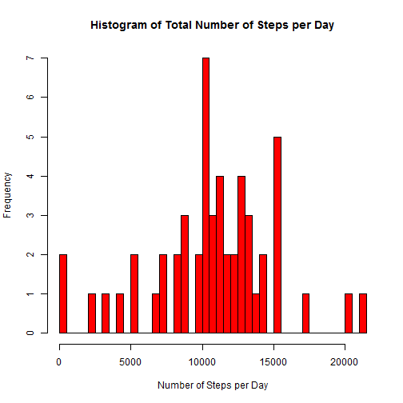
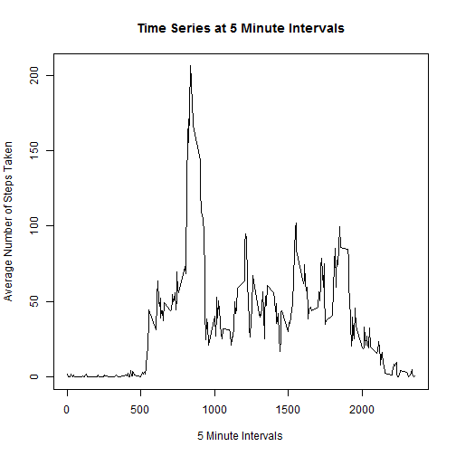
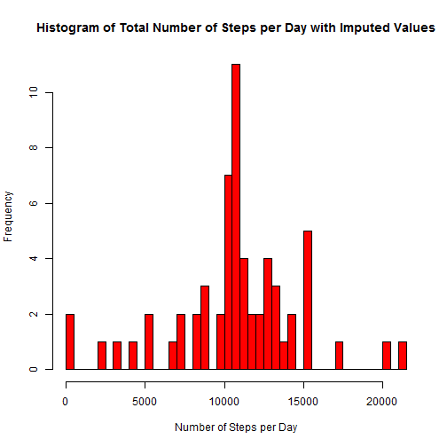
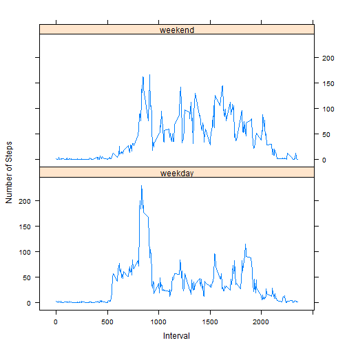

# Reproducible Research: Peer Assessment 1

### Assignment Description

This assignment uses data collected from a personal activity monitoring device accumulated at 5 minute intervals over a two month span.  The data was collected anonymously from a single individual during October and November, 2012.  The data includes the number of steps taken at each interval through out the day.

The .csv data file contains 17,568 observations of the following three variables:  
**steps**: Number of steps taking in a 5-minute interval (all missing values are coded as NA)  
**date**: The date on which the measurement was taken in YYYY-MM-DD format  
**interval**: Identifier for the 5-minute interval in which measurement was taken

The zipped data file may be downloaded from: <https://d396qusza40orc.cloudfront.net/repdata%2Fdata%2Factivity.zip>  

It is also available when forked from the following GitHub site: <http://github.com/rdpeng/RepData_PeerAssessment1>

Using the above data, I have performed the following steps to analyze the data and answer the project questions:

## Loading and preprocessing the data
### Preparation Step: Load all libraries to be used in this project

```r
    library(graphics)
    library(stats)
    library(ggplot2)
    library(xtable)
    library(chron)
    library(lattice)
```

### Step 1: Code for reading in the dataset and/or processing the data
If the data directory doesn't exist, create it.  Then, if the activity.zip file 
isn't present, go get it from the file that was previously downloaded from the 
GitBash Master directory and placed into the working directory. Unzip the file, then 
read the .csv file into the activity data frame.  Run the str() command to check the structure of the data frame:

```r
    if(!file.exists("./data")) {dir.create("./data")}
    if(!file.exists("./data/activity.zip")) {
        file.copy("../RepData_PeerAssessment1/activity.zip", "./data/activity.zip")
        unzip("./data/activity.zip")
    }
    activity <- read.csv("./activity.csv")
    str(activity)
```

```
## 'data.frame':	17568 obs. of  3 variables:
##  $ steps   : int  NA NA NA NA NA NA NA NA NA NA ...
##  $ date    : Factor w/ 61 levels "2012-10-01","2012-10-02",..: 1 1 1 1 1 1 1 1 1 1 ...
##  $ interval: int  0 5 10 15 20 25 30 35 40 45 ...
```
## What is mean total number of steps taken per day?
### Step 2: Histogram of the total number of steps taken each day  
Calculate (i.e. sum) the total number of steps taken per day, then create a histogram of the data, while ignoring the missing values in the dataset:


```r
    Steps.by.day <- with(activity, aggregate(steps, by=list(date), FUN="sum"))
    Steps.by.day <- Steps.by.day[complete.cases(Steps.by.day), ]
    hist(Steps.by.day$x, breaks=nrow(Steps.by.day), col="red", 
        main=("Histogram of Total Number of Steps per Day"), 
        xlab="Number of Steps per Day")
```



### Step 3: Mean and median number of steps taken each day  
Calculate the mean and the median of Steps.by.day$x:


```r
    Steps.Mean <- as.integer(mean(Steps.by.day$x))
    Steps.Median <- as.integer(median(Steps.by.day$x))
    as.data.frame(Steps.Mean)
```

```
##   Steps.Mean
## 1      10766
```

```r
    as.data.frame(Steps.Median)
```

```
##   Steps.Median
## 1        10765
```
## What is the average daily activity pattern?
### Step 4: Time Series plot of the average number of steps taken  
Make a time series plot (i.e type = "l") of the 5-minute interval (x-axis) 
and the average number of steps taken, averaged across all days (y-axis):


```r
    Steps.Time.Series <- aggregate(steps ~ interval, data=activity, FUN="mean")
    plot(Steps.Time.Series, type="l", main="Time Series at 5 Minute Intervals",
         xlab("5 Minute Intervals"), ylab("Average Number of Steps Taken"))
```



### Step 5: The 5-minute interval that, on average, contains the maximum number of steps  
Using the max() function to determine which interval, on average across all the days in the dataset, contains the maximum number of steps:


```r
    Steps.Time.Series$interval[which.max(Steps.Time.Series$steps)]
```

```
## [1] 835
```
## Imputing missing values
### Step 6: Code to describe and show a strategy for imputing missing data  
First, calculate the total number of missing values in the dataset:


```r
    NA_count <- sum(is.na(activity))
    NA_count
```

```
## [1] 2304
```

Next, fix all the NA step values by populating the NA's with the Average steps for that interval. To do this, I used the Steps.Time.Series data frame that was created in Step 4, above, which provides the mean for each 5-minute interval. 

Start by creating a copy of the activity data frame. **NOTE: All updates will be made directly to this new copy**.

```r
    activity2 <- activity
```

Replace the NA values with imputed values by looping through the new data frame.  Update each row where steps == NA, then increment a counter that will be used to check the total count of updates made.  Because the steps variable is an integer, I have applied the round() function on the imputed value.


```r
    x <- 0     #Initialize a counter variable
    for(i in 1:nrow(activity2)) {
        temp <- activity2[i, ]
        if (is.na(temp$steps)) {
            activity2$steps[i] <- round(subset(Steps.Time.Series, interval == temp$interval)$steps)
            x <- x+1
        }   
    }        
```

Verify the count to ensure that the correct number of updates were made:


```r
    x   #Display the count of records updated. This should match NA_count 
```

```
## [1] 2304
```

Finally, verify the NA_count again to confirm there are no longer any NA values in the updated activity2 data frame:


```r
    NA_count2 <- sum(is.na(activity2))
    NA_count2
```

```
## [1] 0
```

### Step 7: Histogram of the total number of steps taken each day after missing values are imputed  
Aggregate the steps again now that all the NA step values have been replaced with imputed values, then create a new histogram:


```r
    Steps.by.day2 <- with(activity2, aggregate(steps, by=list(date), FUN="sum"))
    hist(Steps.by.day2$x, breaks=nrow(Steps.by.day2), col="red", 
         main=("Histogram of Total Number of Steps per Day with Imputed Values"), 
         xlab="Number of Steps per Day")
```



The new histogram shows that the greatest number of steps per day has increased slightly from the previous histogram.

Calculate the mean and median number of steps taken each day for comparison with the previous values:    


```r
    Steps.Mean2 <- as.integer(mean(Steps.by.day2$x))
    Steps.Median2 <- as.integer(median(Steps.by.day2$x))
    as.data.frame(Steps.Mean2)
```

```
##   Steps.Mean2
## 1       10765
```

```r
    as.data.frame(Steps.Median2)
```

```
##   Steps.Median2
## 1         10762
```

These new values are slightly different than the estimates from the first part of the assignment.  The mean has basically stayed the same. The median has increased slightly.

## Are there differences in activity patterns between weekdays and weekends?
### Step 8: Panel plot comparing the average number of steps taken per 5-minute interval across weekdays and weekends

First, add a new factor variable to the activity2 data frame to idenify weekend vs. weekday dates:


```r
    for(i in 1:nrow(activity2)) {
        if (chron::is.weekend(activity2$date[i]) == TRUE) {
            activity2$day.type[i] <- "weekend"
        } else {
            activity2$day.type[i] <- "weekday"
        }
    }        
```

Then, aggregate the intervals by the new day.type variable, calculate the mean, and create the Panel plot using the Lattice library:


```r
    Steps.by.day3 <- with(activity2, aggregate(steps, by=list(interval, day.type), FUN="mean"))
    names(Steps.by.day3) <- c("interval", "day.type", "steps")
    xyplot(steps ~ interval | day.type, Steps.by.day3, type="l", 
           layout=c(1,2),
           xlab="Interval",
           ylab="Number of Steps")
```



